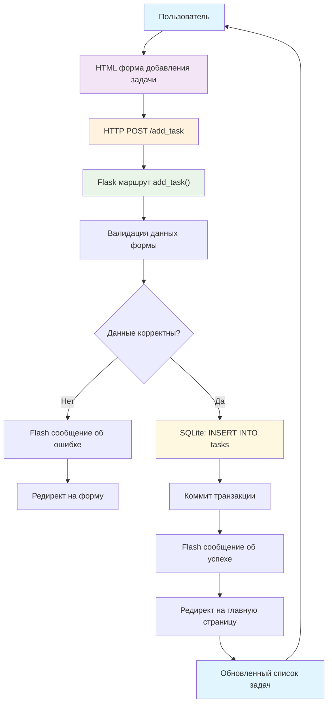

# Case 4 Simple: Простая система управления задачами

## Описание проекта

Простое веб-приложение для управления задачами. Демонстрирует современные подходы веб-разработки на Python Flask с адаптивным интерфейсом Bootstrap.

## Технологии

- **Backend**: Python Flask 3.0
- **Database**: SQLite (файловая БД)
- **Frontend**: HTML5 + Bootstrap 5 + JavaScript
- **Стили**: CSS3 + Bootstrap Icons

## Архитектура компонентов

### Схема добавления задачи

Диаграмма показывает взаимодействие компонентов при создании новой задачи:



### Компоненты системы

1. **Презентационный слой** (HTML Templates)
   - Базовый шаблон с навигацией
   - Формы создания и редактирования
   - Список задач с фильтрацией

2. **Бизнес-логика** (Flask Routes)
   - Обработка HTTP запросов
   - Валидация входных данных
   - Управление сессиями и flash-сообщениями

3. **Слой данных** (SQLite)
   - Хранение задач и метаданных
   - Автоматическая инициализация схемы
   - Транзакционная безопасность

4. **API слой** (REST endpoints)
   - JSON API для внешних интеграций
   - CRUD операции через HTTP методы
   - Статистические данные

## Быстрый старт

### 1. Установка зависимостей
```bash
# Установить Flask
pip install Flask==3.0.0

# Или использовать requirements.txt
pip install -r requirements.txt
```

### 2. Запуск приложения
```bash
# Запустить сервер
python app.py

# Открыть в браузере
# http://localhost:5000
```

### 3. Использование
- Откройте браузер на `http://localhost:5000`
- Создавайте новые задачи
- Отмечайте выполненные
- Фильтруйте по статусу и приоритету
- Просматривайте статистику

## Структура проекта

```
case4_simple/
├── app.py                  # Основное приложение Flask (340+ строк)
├── requirements.txt        # Зависимости Python
├── tasks.db               # База данных SQLite (создается автоматически)
├── templates/             # HTML шаблоны
│   ├── base.html         # Базовый шаблон с Bootstrap
│   ├── index.html        # Главная страница с дашбордом
│   ├── tasks.html        # Список всех задач
│   ├── add_task.html     # Форма добавления задачи
│   └── edit_task.html    # Форма редактирования
└── README.md             # Данное описание
```

## Функциональность

### Веб-интерфейс:
- **Главная страница** - дашборд с статистикой
- **Добавление задач** - форма с валидацией
- **Редактирование** - изменение названия, описания, статуса
- **Удаление** - с подтверждением
- **Фильтрация** - по статусу и приоритету
- **Быстрые действия** - отметить как выполненную

### API endpoints:
- `GET /api/tasks` - получить все задачи в JSON
- `POST /api/tasks` - создать новую задачу
- `PUT /api/tasks/{id}` - обновить задачу
- `DELETE /api/tasks/{id}` - удалить задачу
- `GET /api/stats` - статистика по задачам

## База данных

### Таблица `tasks`:
```sql
CREATE TABLE tasks (
    id INTEGER PRIMARY KEY AUTOINCREMENT,
    title TEXT NOT NULL,
    description TEXT,
    priority TEXT DEFAULT 'medium',  -- low, medium, high
    status TEXT DEFAULT 'todo',      -- todo, in_progress, done
    created_at TIMESTAMP DEFAULT CURRENT_TIMESTAMP,
    completed_at TIMESTAMP
);
```

### Тестовые данные:
При первом запуске автоматически создаются 4 тестовые задачи для демонстрации функциональности.

## Интерфейс

### Особенности дизайна:
- **Адаптивный дизайн** - работает на телефонах и планшетах
- **Bootstrap 5** - современный и красивый UI
- **Цветовая индикация** - приоритеты и статусы
- **Анимации** - плавные переходы и эффекты
- **Уведомления** - flash-сообщения об операциях

### Цветовая схема:
- **Высокий приоритет** - красный цвет (danger)
- **Средний приоритет** - желтый цвет (warning)
- **Низкий приоритет** - зеленый цвет (success)
- **Выполненные задачи** - полупрозрачные с зачеркиванием

## Возможности для расширения

### Простые улучшения:
- **Календарь** - выбор даты выполнения
- **Поиск** - по названию и описанию
- **Пользователи** - система авторизации
- **Файлы** - прикрепление к задачам
- **Напоминания** - email уведомления

### Продвинутые функции:
- **Графики** - визуализация прогресса
- **Теги** - категоризация задач
- **Экспорт** - в Excel, PDF
- **Мобильное приложение** - PWA
- **Многоязычность** - интернационализация

## Тестирование

### Ручное тестирование:
```bash
# 1. Запустить приложение
python app.py

# 2. Открыть браузер: http://localhost:5000

# 3. Протестировать функции:
#    - Создание задачи
#    - Редактирование
#    - Изменение статуса
#    - Удаление
#    - Фильтрация
```

### API тестирование:
```bash
# Получить все задачи
curl http://localhost:5000/api/tasks

# Создать задачу
curl -X POST http://localhost:5000/api/tasks \
  -H "Content-Type: application/json" \
  -d '{"title": "Тестовая задача", "priority": "high"}'

# Получить статистику
curl http://localhost:5000/api/stats
```

## Устранение проблем

### Частые ошибки:

**Flask не установлен:**
```bash
pip install Flask==3.0.0
```

**Порт 5000 занят:**
```python
# В app.py измените последнюю строку:
app.run(debug=True, host='0.0.0.0', port=8000)
```

**База данных не создается:**
- Проверьте права доступа к папке
- Удалите файл `tasks.db` и перезапустите

## Настройка и кастомизация

### Изменение дизайна:
1. **Изучите app.py** - весь код в одном файле
2. **Посмотрите templates/** - HTML шаблоны
3. **Поэкспериментируйте** - измените цвета, тексты
4. **Добавьте функции** - новые поля, фильтры
5. **Изучите API** - откройте `/api/tasks` в браузере

### Идеи для развития:
- Изменить цветовую схему
- Добавить новые приоритеты
- Добавить поле даты выполнения
- Создать систему тегов
- Улучшить мобильную версию

## Преимущества архитектуры

### По сравнению со сложными фреймворками:
- **Понятность** - весь код в одном файле
- **Быстрый старт** - одна команда для запуска
- **Простая БД** - SQLite без настройки сервера
- **Готовый UI** - Bootstrap из CDN
- **Легкая настройка** - минимальные зависимости

### Готово к использованию:
- Работает сразу - без настройки
- Красивый интерфейс - современный дизайн
- Полный функционал - CRUD операции
- API включен - для интеграции
- Расширяемо - легко добавлять функции

## Технические детали

### Маршруты Flask:
- `GET /` - главная страница с дашбордом
- `GET,POST /add_task` - форма добавления задачи
- `GET,POST /edit_task/<id>` - форма редактирования
- `POST /delete_task/<id>` - удаление задачи
- `POST /toggle_task/<id>` - изменение статуса

### Используемые библиотеки:
- **Flask** - веб-фреймворк
- **SQLite3** - встроенная БД Python
- **Bootstrap 5** - CSS фреймворк
- **Bootstrap Icons** - иконки

---

**Технологии:** Python Flask + SQLite + Bootstrap  
**Архитектура:** Monolithic Web Application  
**Лицензия:** MIT 
